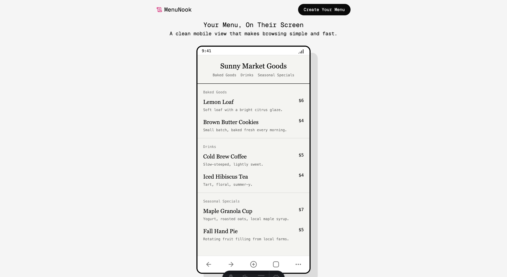
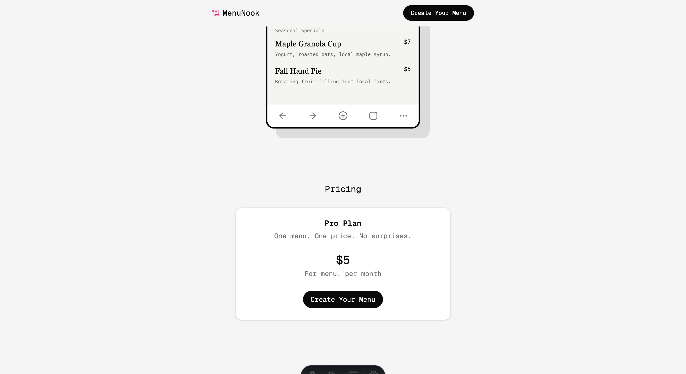

# MenuNook Landing Page

This repository contains the public landing page for MenuNook, a simple tool for pop-up sellers, market vendors, and small-batch makers who want an easy way to share what they’re offering. MenuNook lets anyone create a lightweight, mobile-friendly menu that customers can open instantly through a link or QR code.

## Features

- Simple, mobile-first menu viewing
- QR code sharing
- Categories and items
- Clean, minimal UI preview
- Pricing section

## Tech Stack

- Framework (Astro)
- UI (Tailwind, shadcn/ui)
- Hosting (Vercel)

## Screenshots

